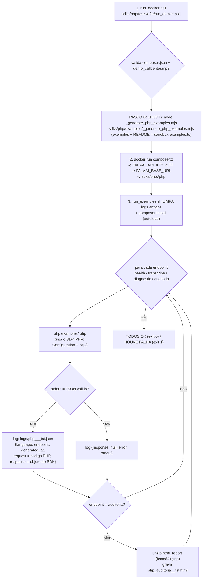

# FLUXO DE TESTES DA SDK PHP (Composer `falaai-api`)
@version 1.1.0 | 30/09/2026 | MANUAL — nao e regenerado pelo exportador de exemplos
SDK: `D:\ProjetoFalaAI\FalaAI\FalaAI_api\sdks\php\` (pacote Composer `actiontecbr/falaai-api`) · Docker: imagem `composer:2` (php + composer juntos)
Regra de fundo: `.opencode/rules/macro/modulos/falaai-api/sdk-fonte-unica.md` (tests/e2e = MANUAL)

> **v1.1.0 (30/09):** padrao 3.1 — wrapper `run_docker.ps1` (PASSO 0a + Docker `composer:2`); runner **v1.2.0** (log JSON canonico + **secoes separadas** + limpa logs + `.html`); exemplos usam **`json_encode`** (objeto do SDK PHP serializado — padrao B); exportador **v1.4.0** (README GERADO). Doc corrigido (era copia do curl).

## Scripts e arquivos usados (nomes e paths exatos — LINGUAGEM: PHP)
| # | Script / Arquivo | Path completo | Papel no fluxo |
|---|---|---|---|
| 1 | `run_docker.ps1` v1.0.0 | `D:\ProjetoFalaAI\FalaAI\FalaAI_api\sdks\php\tests\e2e\run_docker.ps1` | WRAPPER (PowerShell): valida `composer.json` + mp3 → **PASSO 0a** (sync exemplos) → sobe o Docker `composer:2` |
| 2 | `run_examples.sh` v1.2.0 | `D:\ProjetoFalaAI\FalaAI\FalaAI_api\sdks\php\tests\e2e\run_examples.sh` | RUNNER (bash, roda DENTRO do container): **limpa logs antigos**, `composer install`, executa os 4 exemplos, grava os logs JSON + `.html` |
| 3 | `_generate_php_examples.mjs` v1.4.0 | `D:\ProjetoFalaAI\FalaAI\FalaAI_api\sdks\php\examples\_generate_php_examples.mjs` | EXPORTADOR (**PASSO 0a**, roda no HOST): re-exporta os 4 `.php` da FONTE UNICA + **gera o README** (versao/data) |
| 4 | `sandbox-examples.ts` | `D:\ProjetoFalaAI\FalaAI\FalaAI_landing\lib\sandbox-examples.ts` | FONTE UNICA dos exemplos (8 linguagens x 4 endpoints, tokens `{{...}}`) |
| 5 | `health.php` · `transcribe.php` · `diagnose.php` · `audit.php` | `D:\ProjetoFalaAI\FalaAI\FalaAI_api\sdks\php\examples\*.php` | OS 4 EXEMPLOS GERADOS (usam `json_encode` = objeto do SDK PHP serializado) |
| 6 | `README.md` | `D:\ProjetoFalaAI\FalaAI\FalaAI_api\sdks\php\examples\README.md` | manual dos exemplos (**GERADO** pelo exportador v1.4.0 — versao/data) |
| 7 | `demo_callcenter.mp3` | `D:\ProjetoFalaAI\FalaAI\FalaAI_api\sdks\php\tests\e2e\demo_callcenter.mp3` | audio do teste (1.3 MB) |
| 8 | `logs\php_<endpoint>_<ts>_tst.json` (+ `.html`) | `D:\ProjetoFalaAI\FalaAI\FalaAI_api\sdks\php\tests\e2e\logs\` | LOGS gerados pelo runner (**limpa os antigos a cada rodada**) |
| 9 | `VERSION.txt` | `D:\ProjetoFalaAI\FalaAI\FalaAI_api\VERSION.txt` | versao da API que o health devolve (`api_v1.21.49`) — SEM BOM |
| 10 | `_FLUXO_TESTE_SDK_PHP.md` (este doc) | `D:\ProjetoFalaAI\FalaAI\FalaAI_api\sdks\php\examples\_FLUXO_TESTE_SDK_PHP.md` | este doc |

## Requisitos do dev (inviolaveis)
- R-A: roda em Docker DA LINGUAGEM (`composer:2`)
- R-B: roda os 4 exemplos GERADOS (`health/transcribe/diagnose/audit.php`) — nunca reescreve
- R-C: LOG = request (codigo do exemplo) + response (o objeto do SDK PHP) + `.html` da auditoria
- R-D: chave `fai_668e6474b83dd24540860d9ab9df0b738f7171a0f5bd8179` hardcoded no runner (local-only)
- R-E: **PASSO 0 antes de tudo** — exemplos sincronizados com a FONTE UNICA

## Fluxo (com os nomes reais dos scripts)


## Comando (API no micro do dev)
```powershell
powershell -ExecutionPolicy Bypass -File "D:\ProjetoFalaAI\FalaAI\FalaAI_api\sdks\php\tests\e2e\run_docker.ps1" -BaseUrl http://host.docker.internal:8002 -Only all
# -Only: all | health | transcribe | diagnostic | auditoria
# health = publico (sem creditos) · transcribe/diagnostic/auditoria = consomem creditos da chave FAI
```

## Log (formato — secoes separadas por linha em branco, JSON valido)
```json
{
  "language": "php",
  "endpoint": "health",
  "generated_at": "2026-09-30T16:08:46Z",

  "request": "<codigo do exemplo .php, linhas escapadas como \n>",

  "response": { "o objeto do SDK PHP serializado (json_encode) — snake_case" }
}
```
Falha: `"response": null, "error": "<stdout/stderr>"` · Auditoria: + `php_auditoria_<ts>_tst.html` (unzip de `html_report`)

## O que garantir
1. O exemplo usa o SDK PHP (`Configuration` + `*Api`, `json_encode`) — NUNCA chamada HTTP/curl direta.
2. O request sai do SDK (Bearer fai_...) — a API responde — o SDK devolve — o runner grava o log.
3. PASSO 0 roda ANTES de qualquer teste (exemplos na ultima versao da fonte unica).
4. O runner LIMPA os logs antigos a cada rodada (so os da execucao atual ficam).
5. Refaco a qualquer momento: mesmo comando = mesmo comportamento (deterministico).

## Historico
- **v1.1.0 (30/09 13:08):** padrao 3.1 — wrapper `run_docker.ps1`; runner v1.2.0 (log JSON canonico + secoes separadas + limpa logs + `.html`); exemplos `json_encode` (objeto do SDK PHP); exportador v1.4.0 (README GERADO); doc corrigido (era copia do curl).
- **v1.0.0 (30/09):** doc inicial (copia do curl — corrigido na v1.1.0).